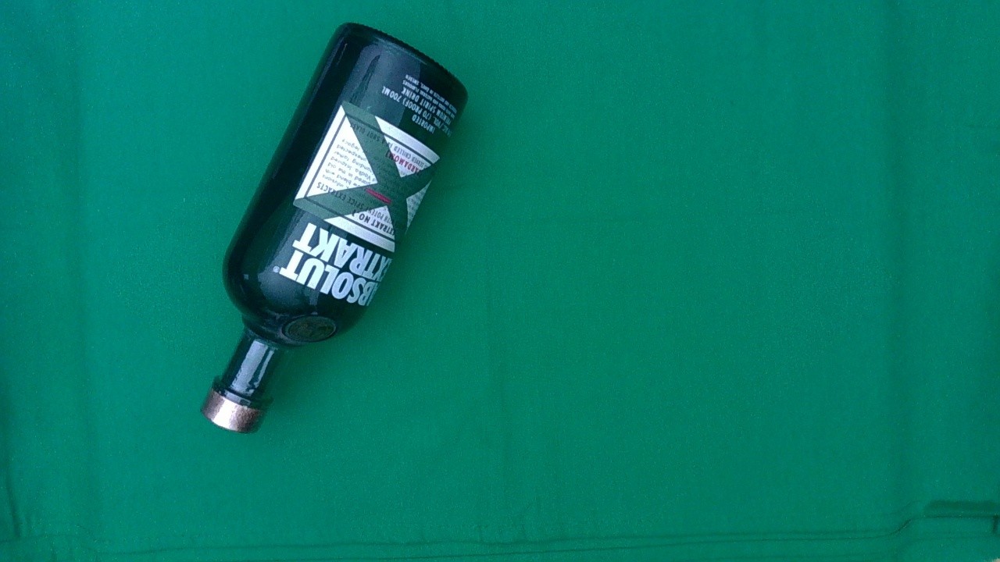

# Object Segmentation on Green Background

### Objective

The objective of this work is to develop a program that automatically generates binary masks from RGB images of items on Green background:
- The program should process all images present in the same folder.
- It will generate binary masks without requiring user intervention.
- These binary masks will isolate objects from the background, facilitating their further processing.

### Prerequisites

- **Python:** The script has been developed and tested with Python 3.8.2.
- **Libraries:** The following libraries are required:
  - numpy 1.24.4
  - opencv 4.9.0
  - rembg 2.0.53
  - sys

### Usage

This script is ready to be executed from the command line. You can pass the path to your image folder as an argument when running the script.

Example: `python Main.py "C:\path\to\image\folder"`

Upon executing the script for the first time, you may see a message indicating that the script is downloading a file named "u2net.onnx" from the project repository "rembg" on GitHub. This file is actually a pre-trained neural network model specifically designed to perform background removal in images.

This initial download is necessary as the script requires this model to perform background removal effectively. Once the download is complete, the model is stored in a specific directory on your local system and reused to process subsequent images.

### Expected Output Data

1. The generated masks are saved in the same directory as the original images, with a "_mask" suffix added to the filename and in JPG format.
2. Once the script has processed all images in the specified folder, it displays "Processing complete." to indicate that the process is finished.

## Program Results

In this section, you can view the program results. The original image is displayed on the left, while the program's result is displayed on the right.

<table><tr>
<td> 
  <h3 align="center">Original Image</h3>
  

    
  
 
</td>
<td> 
  <h3 align="center">Program Result</h3>
  

    
  
 
</td>
</tr></table>